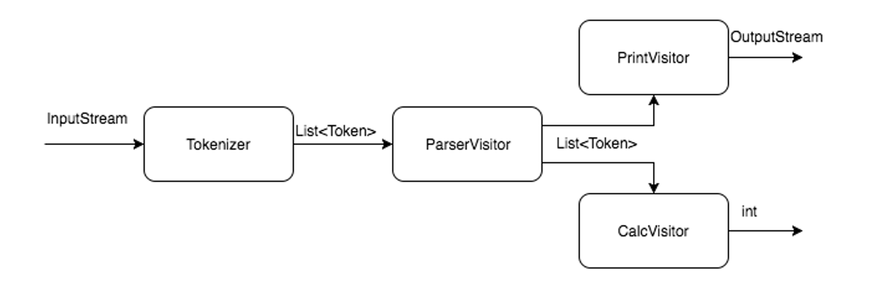
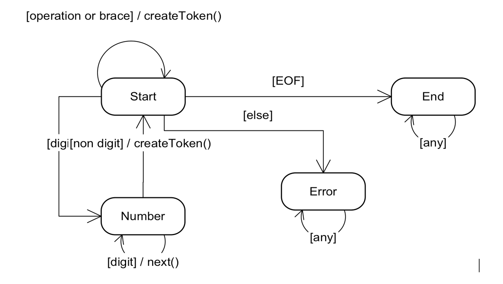

# HW6: Reverse Polish Notation calculator

## Objective

Gain practical experience of using behavioural-patterns 
[visitor](https://en.wikipedia.org/wiki/Visitor_pattern) and [state](https://en.wikipedia.org/wiki/State_pattern).

## Description

The task is to implement calculator which is capable of transforming simple arithmetic expressions into 
[RPN](https://en.wikipedia.org/wiki/Reverse_Polish_notation) and to calculating them.

Arithmetic expression example: `(23 + 10) * 5 – 3 * (32 + 5) * (10 – 4 * 5) + 8 / 2`

Expression may contain brackets, whitespaces, digits and such binary operations: +, -, *, /.

To evaluate expression it's necessary first of all to break it into tokens:
- Single token per single bracket and operation
- Token for integers

Example: `(30 + 2) / 8 -> LEFT NUMBER(30) PLUS NUMBER(2) RIGHT DIV NUMBER(8)`

In the next step tokens are transformed to [RPN](https://en.wikipedia.org/wiki/Reverse_Polish_notation), 
which doesn't contain brackets and can be easily calculated using stack.

Example: `LEFT NUMBER(30) PLUS NUMBER(2) RIGHT DIV NUMBER(8) -> NUMBER(30) NUMBER(2) PLUS NUMBER(8) DIV`

So the whole application scheme looks something like this: 
- Input data splitted into tokens by Tokenizer
- ParserVisitor traverses all tokens from previous step and converts it in [RPN](https://en.wikipedia.org/wiki/Reverse_Polish_notation)
- Then parsed expression is printed by PrintVisitor
- And finally parsed expression is calculated by CalcVisitor

Visitors are permitted to use stacks or other data structures in order to store intermediate results.

The easiest way to implement tokenizer is using finite state-machine which reads symbols from input stream by one
and converts them into tokens. The state-machine _must be_ implemented using state-pattern and look 
like this: 

As the result there have to be an application which reads input from terminal and then prints expression transformed 
into RPN and after that prints the expression's result. If the input data isn't correct - print the corresponding error.

## Classes structure

```java
interface Token {
    void accept(TokenVisitor visitor);
}

interface TokenVisitor {
    void visit(NumberToken token);
    void visit(Brace token);
    void visit(Operation token);
}
```

`NumberToken`, `Brace`, `Operation` implements `Token`.

All visitors implements TokenVisitor.
